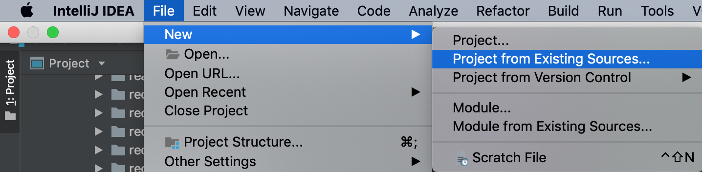
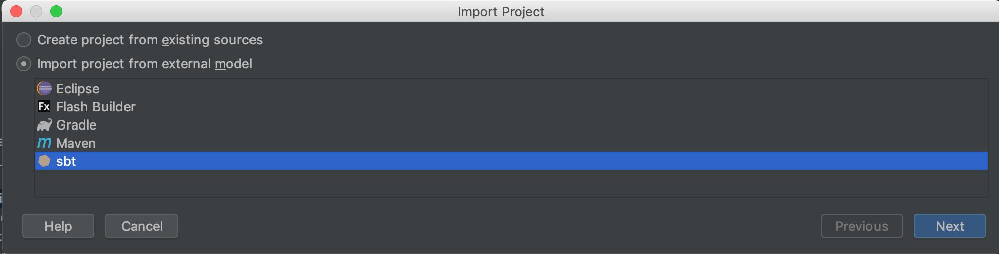
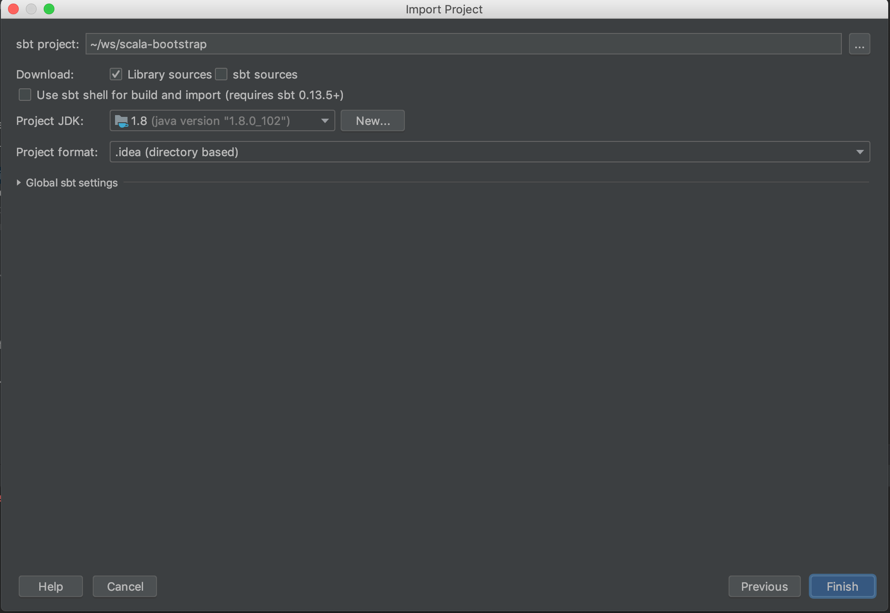
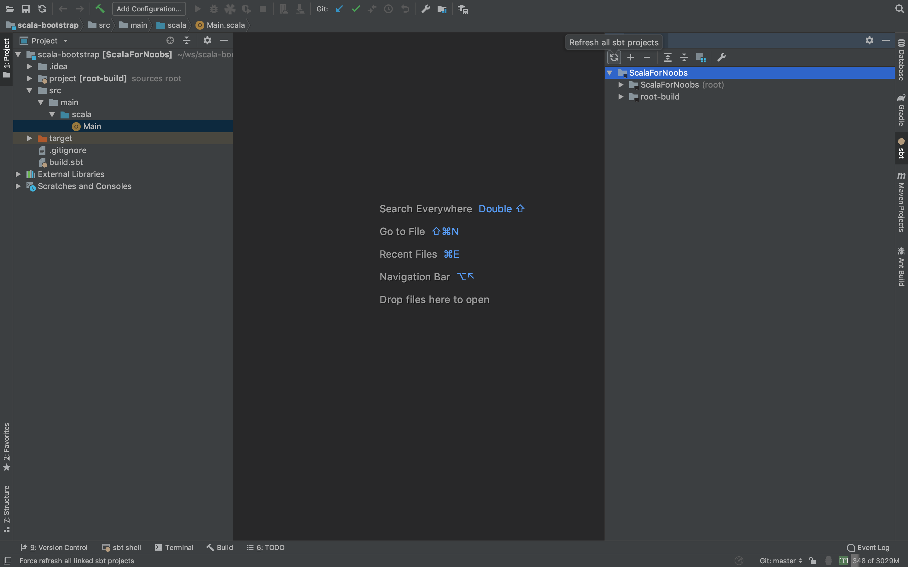
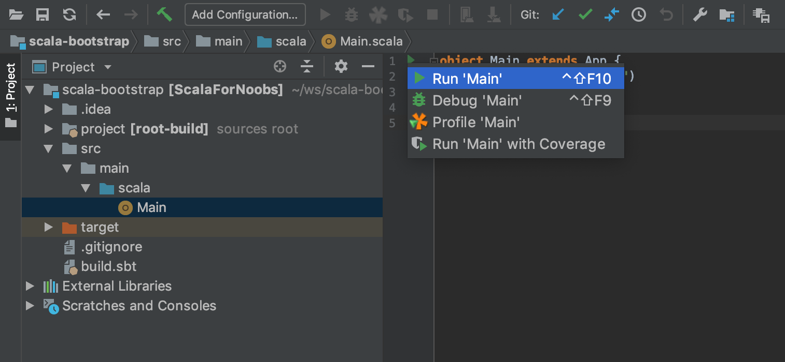

# scala-bootstrap

This project is the support for the exercices. It can be run both in the command line and in an IDE, but we do not recommend usage of the command line as long as you're not familiar with Scala/SBT.
We recommend installing IntelliJ, but you can still use Scala-Eclipse IDE.

## Install
Make sure you have Java 1.8 or higher installed on your machine. If not, [follow the instructions](https://www.java.com/fr/download/)
Install IntelliJ following the steps on the [website](https://www.jetbrains.com/idea/download/).

## Run the project

### Import the project in intelliJ

Then choose the directory containing the project and `Open`.

### Refresh and run the project

Click on the circle arrows (top-right) to refresh the project.

Then click on the green triangle next to the Main function, and `Run 'Main'`

You should see the output of the program ! And you're done installing the project.
